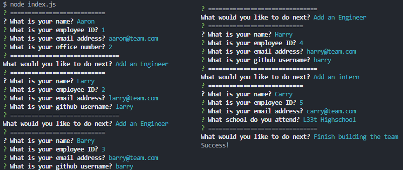
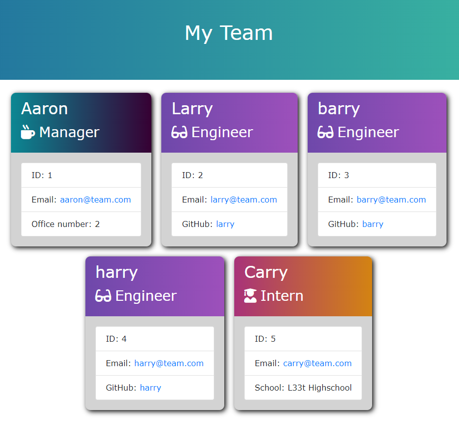
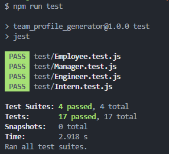

# team_profile_generator
Week 12 assignment - command line app using classes and Node.js

## Description

The task was to create command line team profile generator using javscript and node.js. The task is to allow users to quickly create HTML page with details about their team.
Some of the acceptance criteria for this project:

* Create a command-line application that accepts accepts user input using the provided starter code.   
  * Create classes for each team member provided and export them. The tests for these classes (in the `_tests_` directory) must ALL pass.     
    * The first class is an `Employee` parent class with the following properties and methods:       
      * `name`
      * `id`
      * `email`
      * `getName()`
      * `getId()`
      * `getEmail()`
      * `getRole()`&mdash;returns `'Employee'`     
    * The other three classes will extend `Employee`.      
    * In addition to `Employee`'s properties and methods, `Manager` will also have the following:
      * `officeNumber`
      * `getRole()`&mdash;overridden to return `'Manager'`
    * In addition to `Employee`'s properties and methods, `Engineer` will also have the following:
      * `github`&mdash;GitHub username
      * `getGithub()`
      * `getRole()`&mdash;overridden to return `'Engineer'`
    * In addition to `Employee`'s properties and methods, `Intern` will also have the following:
      * `school`
      * `getSchool()`
      * `getRole()`&mdash;overridden to return `'Intern'`
    * Finally, although it’s not a requirement, consider adding validation to ensure that user input is in the proper format.   
  * Write code in `index.js` that uses inquirer to gather information about the development team members and creates objects for each team member using the correct classes as blueprints.
    * When a user starts the application then they are prompted to enter the **team manager**’s:
      * Name
      * Employee ID
      * Email address
      * Office number
    * When a user enters those requirements then the user is presented with a menu with the option to:
      * Add an engineer
      * Add an intern 
      * Finish building the team
    * When a user selects the **engineer** option then a user is prompted to enter the following and then the user is taken back to the menu:
      * Engineer's Name
      * ID
      * Email
      * GitHub username
    * When a user selects the intern option then a user is prompted to enter the following and then the user is taken back to the menu:
      * Intern’s name
      * ID
      * Email
      * School
    * When a user decides to finish building their team then they exit the application, and the HTML is generated.
  * Call the `render` function (provided for you) and pass in an array containing all employee objects; 
    * The `render` function will generate and return a block of HTML including templated divs for each employee!
  * Create an HTML file using the HTML returned from the `render` function. 
    * Write it to a file named `team.html` in the `output` folder. 
    * You can use the provided variable `outputPath` to target this location.

Website: n/a
 Repository: https://github.com/LapworthAaron/team_profile_generator

In this project i have learnt how to use node.js further, inparticular the inquirer and jest package. Building Classes and Sub-classes and building code from tests.

## Table of Contents (Optional)

- [Installation](#installation)
- [Usage](#usage)
- [Tests](#tests)
- [Credits](#credits)
- [License](#license)

## Installation

Install folder structure as is, into a root directory.
Then follow the install requirements in the package.json `npm install`
If you don't want to use `npm install` then run the following for individual packages:
* you will need to install inquirer v8.0.0 using npm `npm install inquirer@8.0.0`
* you will need to install jest using npm `npm install jest --dev`

## Usage
*[Video](https://drive.google.com/file/d/1qbkhW0fhhHwDLrdS7PB882pfe2xnjXdD/view)* of how to use the generator
 
 

Run the file using: node index.js
You first have to fill in the information for the Manager.
Once completed, you get presented with the menu screen, if you select the first 2 options, you will end up back at the menu screen again.
* Add an Engineer: answers the questions to populate info about your engineers
* Add an Intern: answers the questions to populate info about your interns
* Finish building the team: Take the information from the Manager, Engineers and Interns and dynamically build an HTML page with the information in.

The html file will be outputted to your ./output/team.html

## Tests

This application has a series of tests, for each class that has been created, ensure that all these tests pass for proper functionality.

Run `npm run test` to run the tests.

## Credits

© 2023 Aaron Lapworth. Confidential and Proprietary. All Rights Reserved.

## License

MIT License

Copyright (c) 2023 Aaron Lapworth

Permission is hereby granted, free of charge, to any person obtaining a copy
of this software and associated documentation files (the "Software"), to deal
in the Software without restriction, including without limitation the rights
to use, copy, modify, merge, publish, distribute, sublicense, and/or sell
copies of the Software, and to permit persons to whom the Software is
furnished to do so, subject to the following conditions:

The above copyright notice and this permission notice shall be included in all
copies or substantial portions of the Software.

THE SOFTWARE IS PROVIDED "AS IS", WITHOUT WARRANTY OF ANY KIND, EXPRESS OR
IMPLIED, INCLUDING BUT NOT LIMITED TO THE WARRANTIES OF MERCHANTABILITY,
FITNESS FOR A PARTICULAR PURPOSE AND NONINFRINGEMENT. IN NO EVENT SHALL THE
AUTHORS OR COPYRIGHT HOLDERS BE LIABLE FOR ANY CLAIM, DAMAGES OR OTHER
LIABILITY, WHETHER IN AN ACTION OF CONTRACT, TORT OR OTHERWISE, ARISING FROM,
OUT OF OR IN CONNECTION WITH THE SOFTWARE OR THE USE OR OTHER DEALINGS IN THE
SOFTWARE.